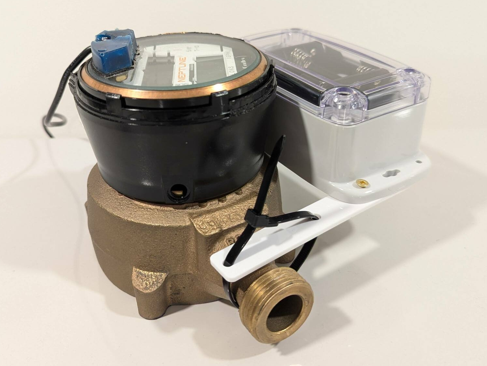
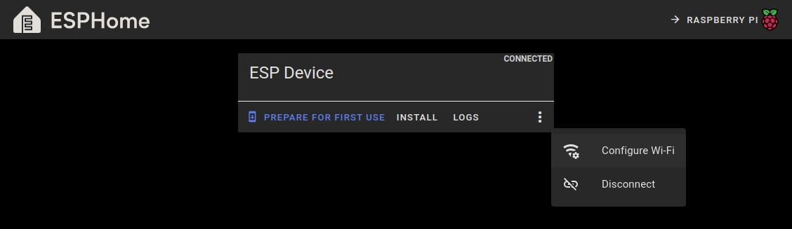
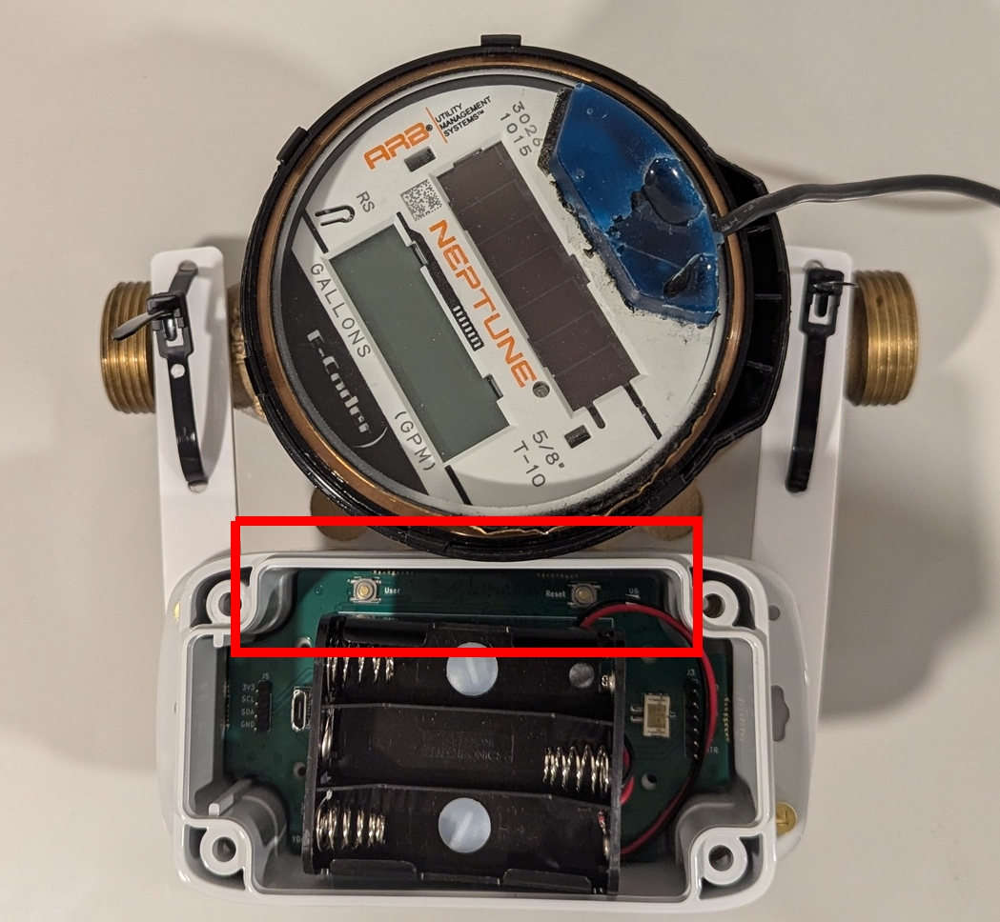

## Overview

Hardware version 0.4 features an IP68 water resistant enclosure for outdoor use. The electronics feature an ESP32-S3 and the ALT021-10E magnetoresistive sensor.

### **Precautions**

YDrip is stil in Beta and testing is ongoing. The following precautions should be followed to ensure reliability. If you find problems 

#### **1. Battery Orientation**
<u>YDrip does not include reverse polarity protection.</u> Inserting batteries incorrectly can permanently damage the internal electronics so be careful.

#### **2. Water Submersion**
<u>It is not recommended to submerge the device for long periods of time.</u> The enclosure is rated **IP68**, meaning it can resist water ingress for short periods (up to 1 meter depth for 30 minutes). However, there have been no long term tests for installations like a pit that regularly fill with water, especially under temperature change. Do so at your own risk.

#### **3. Magnetic Interference**
<u>Avoid installation near power lines or other magnetic field sources.</u> YDrip’s sensor is highly sensitive to magnetic fields. Strong magnets can permanently disrupt the sensor, leading to inaccurate readings. Magnetic fields may also interfere with readings.

#### **4. Extreme Temperatures**
The components selected for YDrip are rated for industrial temperature ranges, however there has been no long term testing done. You may notice issues with battery life, gasket failure or calibration issues. Please report them on [Github](https://github.com/YDrip/ydrip-esphome/issues).

Consider using [Energizer Ultimate Lithium](https://energizer.com/batteries/energizer-ultimate-lithium-batteries/) batteries for better temperature performance.

### **Hardware Setup**

3 AA batteries are required to power the device. Any 1.5v alkaline or rechargeable NiMH batteries work fine. Use [Energizer Ultimate Lithium](https://energizer.com/batteries/energizer-ultimate-lithium-batteries/) batteries if you are installing the device outdoors in extreme weather conditions.

**LED Color Code Legend**

- **Yellow**: Uncalibrated, waiting for calibration.
- **Flashing Red**: Calibration failed.
- **Blue**: Calibration running.
- **Green**: Device is calibrated.
- **No LED**: The device is sleeping and measuring water usage.

#### Connecting to Wi-Fi

1. Insert a micro USB cable into the device. Note, it does not receive power over USB.
2. Using Chrome, open the [ESPHome Webtool](https://web.esphome.io/). Click connect and select the serial port of the device. Then click the 'more' icon and select 'Configure Wi-Fi'. Follow the instructions from there.

#### Installation

Install YDrip around your water meter housing using the reusable zip-ties. The bottom of the case should line up with the top of the brass housing and should be as close as possible. See the picture at the top of this section. The PCB should be oriented so the side with the two buttons are facing the brass housing.

### **Calibrating the Device**
At this point the yellow light should on indicating it has not been calibrated. To calibrate:

1. Turn on a faucet at full power.
3. Press the (awkwardly placed) **User button** on the device. The LED will:
    - Blink **blue** for about a minute during calibration.
    - Turn **green** once calibration is complete.

If the LED blinks **red**, calibration failed. Repeat the calibration with the logs open using the ESPHome Webtool.

### Adding to Home Assistant

Once your YDrip device is calibrated and configured, integrate it with Home Assistant to monitor water usage:

1. In Home Assistant, go to **Settings > Devices & Services**.
2. Click **Add Integration** and search for **ESPHome**.
3. Add your YDrip device by entering its IP address.
4. Confirm the device appears in your Home Assistant dashboard.

The ESPHome integration exposes three sensors:

1. Water usage in cubic meters
2. Leak detection
3. Battery percentage (A rudimentary conversion of battery voltage to capacity)

### Modifying Settings

You will need to install the ESPHome Add-on in Home Assistant to upload a new YAML. You can also recompile using the command line and upload via serial as well.

#### **Installing the ESPHome Add-on**
1. Open your Home Assistant dashboard.
2. Navigate to **Settings > Add-ons > Add-on **.
3. Search for and install the ESPHome add-on.
    - Note: Only certain [versions](https://www.home-assistant.io/installation/#advanced-installation-methods)  of Home Assistant support add-ons. Ensure your Home Assistant instance supports them. Using a VM for Home Assistant OS is probably the simplest method.

#### YAML Settings

A sample YAML file for YDrip can be found on [Github](https://github.com/YDrip/ydrip-esphome/blob/main/ydrip.yaml). The following section configures usage and leak alert wake up times

    ############### Water meter config  ####################
    
    sensor:
      - platform: ydrip
        id: ydrip_sensor
        usage_alert_count: 1024
        leak_alert_count: 32
        low_freq_leak_thresh: 0.125
        usage:
          name: "Water Usage"
        leak:
          name: "Leak Detection"
        battery_level:
          name: "Battery Level"

- **usage_alert_count:** Number of magnet rotations to wake up the ESP and report water usage. Should be a power of 2.
- **leak_alert_count:** Number of magnet rotations below low_freq_leak_thresh to wake up the ESP and report a leake. Should be a power of 2.
- **low_freq_leak_thresh:** Magnetic rotation frequency cutoff Hz.

You should also change your fallback hotspot SSID and password.

    # Enable fallback hotspot (captive portal) in case wifi connection fails
    ap:
      ssid: "Home Fallback Hotspot"
      password: ""

### Flashing New Releases

To keep your YDrip device updated:

1. Download the latest firmware from the [YDrip GitHub releases page](https://github.com/YDrip/ydrip-pcb/releases).
2. Use the ESPHome Webtool or the Home Assistant ESPHome add-on to flash the firmware to your device.

---

Enjoy using YDrip to monitor your water usage and conserve resources. If you encounter any issues, visit the [GitHub Issues page](https://github.com/YDrip/ydrip-esphome/issues) for support.